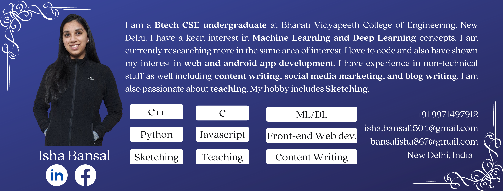

### 👋 Hi there! I'm Isha

## About Me
<ul>
<li>I am a <b> Btech CSE undergraduate </b> at Bharati Vidyapeeth College of Engineering, New Delhi. 👩‍🎓</li>
  <li>I have a keen interest in <b>Machine Learning and Deep Learning concepts 🤖</b>. I am currently learning more in the same area of interest 💻.</li>
<li>I love to code 👩‍💻and also have shown my interest in <b>web 🖥 and android app development 📱.</b></li>
  <li>I have experience in <b>non-technical</b> stuff as well including <b>content writing 🗒, social media marketing 📢, and blog writing ✍</b>.</li>
  <li>I am also passionate about <b>teaching</b> 👩‍🏫. </li>
  <li>My hobby includes <b>Sketching</b> ✍.</li>
  <li><a href="https://isha-bansal.netlify.app/"> Check my website </a> to know more about me.</li>
  <li>For my blogs on Machine Learning and Deep Learning  : <a href="https://www.askpython.com/author/isha" target="_blank"> Click here</a>!</li>
  <li>For my blogs on Python Programming Language : <a href="https://www.askpython.com/author/isha" target="_blank"> Click here</a>!</li>
  </li>For some more blogs on Python  : <a href="https://www.askpython.com/author/isha" target="_blank"> Click here</a>!</li>
</ul>

## Connect with Me

  
    
   
  
  
   
  
  
  
  

<h3>:fire: My Stats:</h3>

  
  
  

<!--
   
  
  **IshaBansal0408/IshaBansal0408** is a ✨ _special_ ✨ repository because its `README.md` (this file) appears on your GitHub profile.
  
  
  
  

  

  

!-->
