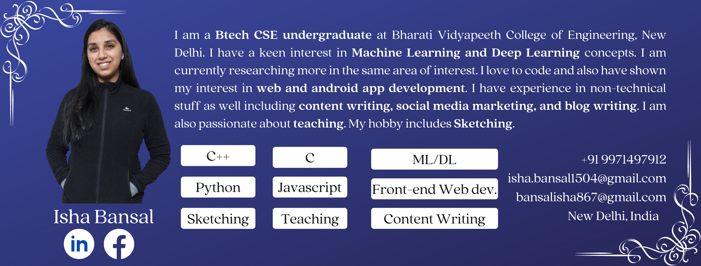

  

<h1 align="center">Hi, I'm Isha Bansal 👋</h1>

  <strong>Software Engineer | ML Researcher | Blogger | Sketch Artist</strong>
   
  Passionate about building intelligent systems and turning complex problems into clean, scalable code.
   
  ...and occasionally turning bugs into features (intentionally, of course). 😉
   
  <b>PS: If you find bugs in my code, please send coffee as a bribe. ☕</b>

---

## 🚀 About Me

* 🎓 Completed my M.Tech in **Machine Learning & AI** from **BITS Pilani**.
* 🎓 Also hold a B.Tech in Computer Science from **BVCOE, New Delhi**.
* 💡 Actively researching deep learning, intelligent automation, and all things AI.
* 💻 Skilled in Python, Java, Spring Boot, Django, Angular, Playwright, and Selenium.
* ✍️ I love sharing knowledge as an **active blogger** on ML/Python and mentoring juniors.
* 🎨 When I'm not coding, I'm probably sketching!
---

## 🛠️ My Tech Stack

  

---

## 💬 Connect with Me

  
  &nbsp;
  
  &nbsp;
  
  &nbsp;
  

---

## 📊 My GitHub Stats

  
  &nbsp;&nbsp;&nbsp;
  

---

## 🏆 My GitHub Trophies

  

---

## 📈 My Recent Activity

  

